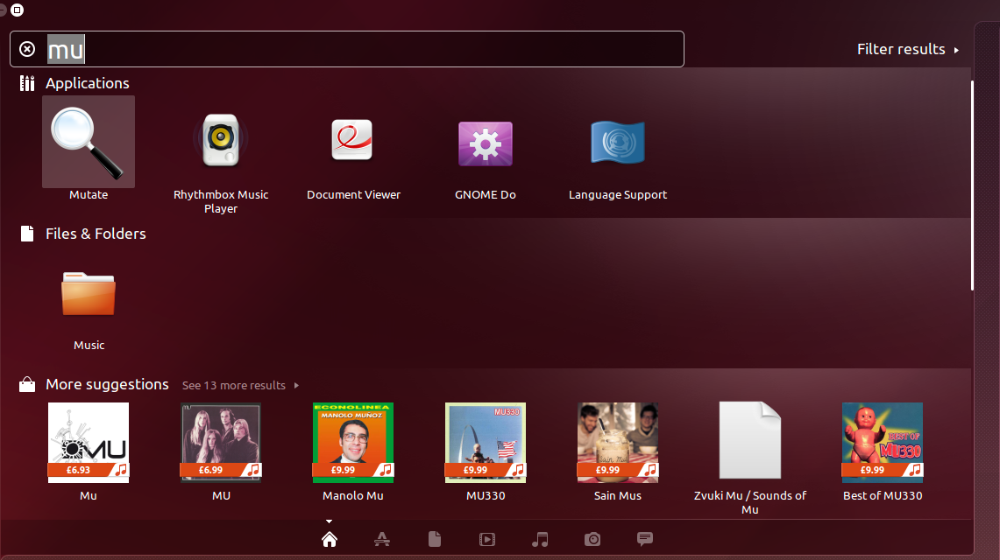
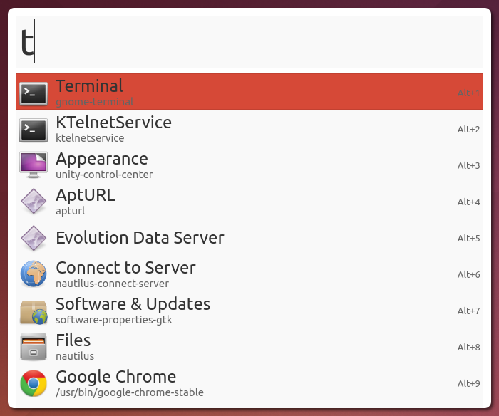
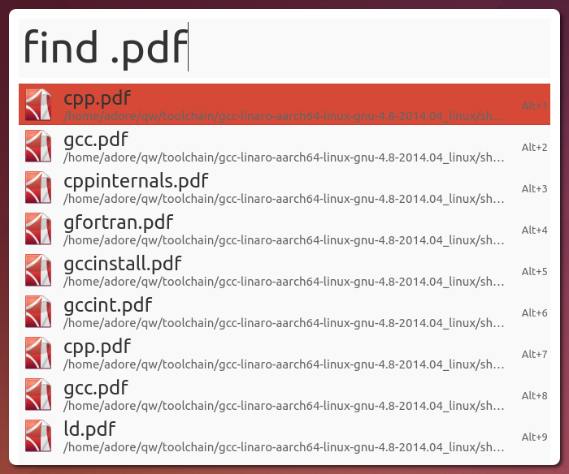
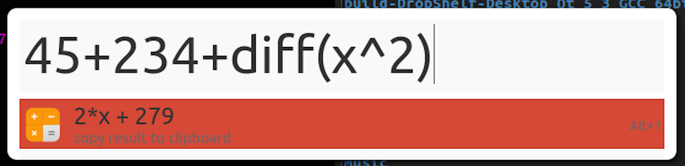
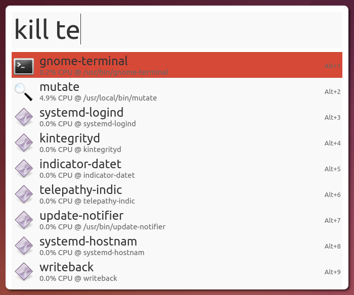
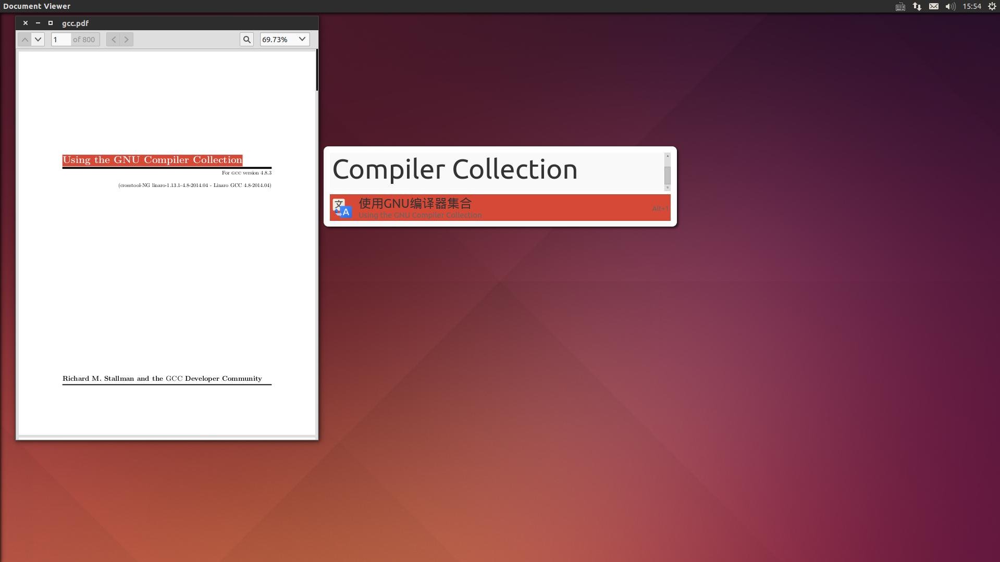
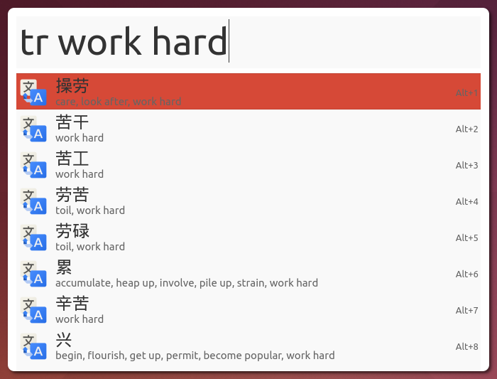

## Mutate, Linux平台上的Alfred
    Mutate 是一个受 Alfred 启发而设计的应用启动器，通过快捷键组合可以方便您快速执行常见任务

> 图片如下:


### 安装
#### 编译安装
1. 安装依赖
```
sudo apt-get install build-essential qt5-qmake qt5-default libgtk2.0-dev libqt5x11extras5-dev libboost-regex-dev
```
2. 下载并编译
```
git clone https://github.com/qdore/Mutate.git
cd Mutate/src
qmake
make
```
3. 安装
```
sudo make install
cd ..
sudo cp info/mutate.png /usr/share/icons
sudo cp info/Mutate.desktop /usr/share/applications
mkdir -p ~/.config/Mutate
cp -R config/* ~/.config/Mutate
chmod -R a+x ~/.config/Mutate/scripts
chmod -R a+w ~/.config/Mutate
sed -i "s|{home}|$HOME|g" ~/.config/Mutate/config.ini
```

4. 快捷键
> 默认吊起快捷键 Ctrl + d

5. 功能
- Find Applications & Files



- Find Files



- Calculate(thanks t413)
```
NOTE:You must install sympy first:
sudo apt-get install python-pip
sudo pip install sympy
```



- Kill Processes



- Google Translate
Select some words use your mouse, then press Ctrl+T (user configurable): 



Or type 'tr' and some words: 




- Quickly Search the Web

Google Search


#### 更多详情请看: 
[网址](https://github.com/qdore/Mutate)

