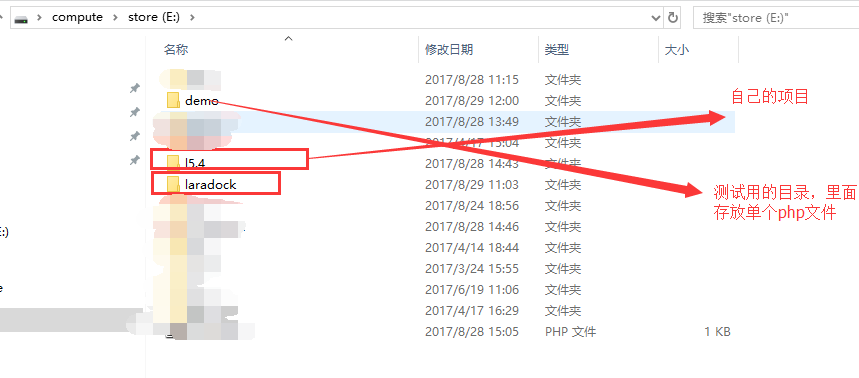

## 前提：

### docker version
```
Client:
 Version:      17.06.1-ce
 API version:  1.30
 Go version:   go1.8.3
 Git commit:   874a737
 Built:        Thu Aug 17 22:48:20 2017
 OS/Arch:      windows/amd64

Server:
 Version:      17.06.1-ce
 API version:  1.30 (minimum version 1.12)
 Go version:   go1.8.3
 Git commit:   874a737
 Built:        Thu Aug 17 22:54:55 2017
 OS/Arch:      linux/amd64
 Experimental: true
```

## laradoc
这里记录一下个人所选择的安装**流程**及遇到的**坑**和简单**使用**

> **具体可参考：**
> 
> [英文]('http://laradock.io')
> 
> [中文:v5.0.0]('https://github.com/laradock/laradock/blob/v5.5.0/README-zh.md')

### 安装流程：
#### 依赖：
- [Git](https://git-scm.com/downloads)
- [Docker](https://www.docker.com/products/docker/)
#### 安装：
-  克隆 Laradock 仓库:将laradock.git克隆到跟你的项目平级的目录下
```
    git clone https://github.com/laradock/laradock.git
```




- 编辑laradock目录下的.env 文件（如果没有.env，请复制.env.example）

```
cp .env.example .env
```

- 修改.env文件（这个很重要，基本上nginx跟mysql及php的配置都在里面可以配置） 
由于，我需要配置多项目，所以，做如下修改：
```
APPLICATION_1=../  这一行代表nginx的www目录的位置，../：指的是laradock仓库的上一级目录
```

### 使用：
#### 运行nginx跟mysql的服务
```
docker-compose up -d nginx mysql
```
#### maybe可以打开浏览器访问localhost，如果不行请往下看。
#### 自定义虚拟域名
- 进入laradock/nginx/sites

- 复制一份`sample.conf.example`重命名为`your like.conf`

- 修改
```
    server_name your like;
    root /var/www/your like;
```

-  重启nginx服务
`docker-compose restart nginx`

#### 配置laraval项目连接数据库
打开laravel项目的.env文件，修改`DB_HOST=XXX`为`DB_HOST=mysql`


### 常用的docker-compose命令
`docker-compose up -d nginx`：Create and start containers

`docker-compose down` ：Stop and remove containers, networks, images, and volumes

`docker-compose images`: List images

`docker-compose exec`:  Execute a command in a running container

### some坑（一下的.env文件是v5.5.5）：

- clone下的laradock后，必须`copy .env.example`并重命名为 `.env`。
- 有可能laradock有些版本使用起来有bug。比如，个人使用过的v5.5.5，mysql启动不了
    - 解决方案(个人)
    1. 切换版本，进入laradock。使用`git tag`列出所有的tag
    2. 使用`git checkout v5.0.0`，切换版本
    3. 查看当前分支版本：`git branch`
- mysql,php,nginx的配置信息都在laradock/.env文件里
    - 切换php版本，可以改PHP_VERSION=70。
    - 新增php扩展，可以改PHP_FPM_INSTALL_BCMATH=true（开启bc函数扩展）
- docker-compose命令得进去laradock才能执行 


  [1]: /img/bVTVdN
